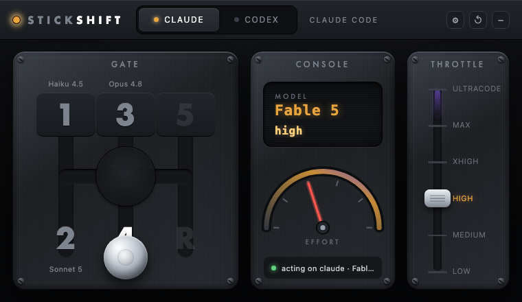
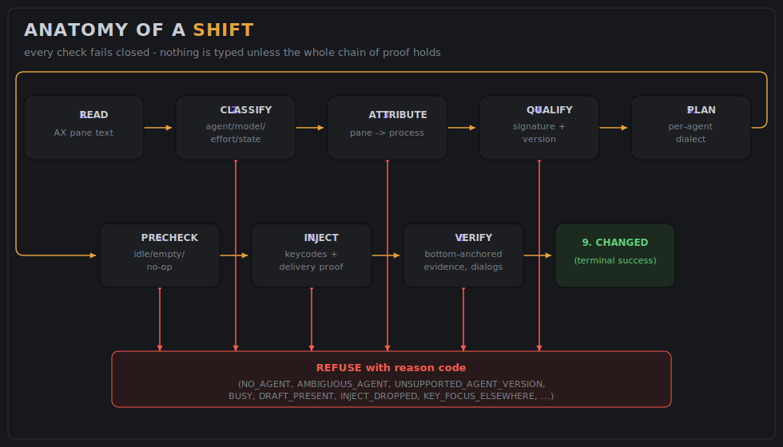
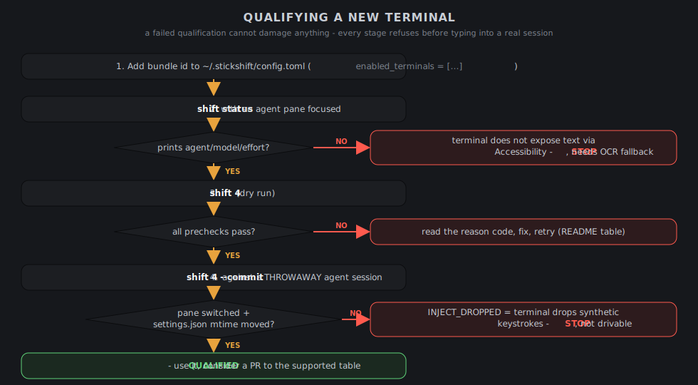
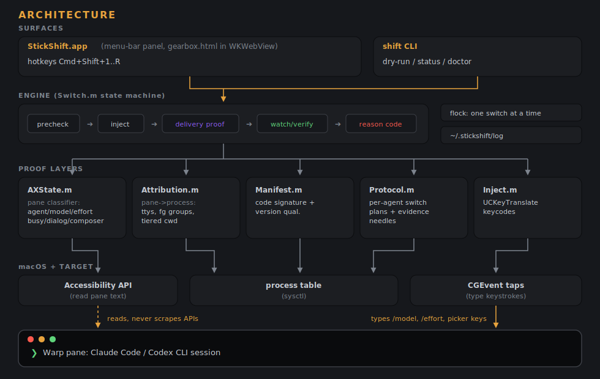

# StickShift

A macOS menu-bar gearbox that shifts the AI model and reasoning effort of whichever
agent, Claude Code or Codex CLI, is running in the terminal pane you're looking at.
Pull the stick to a gate and the model changes in that pane. Drag the throttle and the
effort changes. It is a skeuomorphic H-pattern gearshift for your coding agents.



StickShift never edits config files, never calls provider APIs, and never uses any
terminal automation API. It reads the focused pane through macOS Accessibility, proves
the pane holds a local, code-signed, qualified agent that is idle with an empty
composer, and then types the same commands you would type by hand (`/model`, `/effort`,
or Codex's picker keys) as real keyboard events. Everything it cannot prove, it
refuses, with a reason code instead of a keystroke.

## Quick start

```sh
git clone https://github.com/earlyaidopters/stickshift && cd stickshift
./scripts/setup.sh
```

Grant Accessibility when the app asks, quit and reopen it once, focus a terminal pane
running Claude Code or Codex, pull a gear. Or skip the reading entirely: point your
coding agent at this repo and say **"set up StickShift on this Mac"** — `AGENTS.md`
tells it everything, including how to adapt to your terminal and debug refusals.

macOS only (see `docs/WINDOWS.md` for the port assessment). Warp is verified end to
end; other terminals are [qualifiable in four steps](#supported-terminals).

---

## Contents

1. [The gearbox](#the-gearbox)
2. [Safety model](#safety-model)
3. [Anatomy of a shift](#anatomy-of-a-shift)
4. [Install](#install)
5. [Signing identity and Accessibility](#signing-identity-and-accessibility)
6. [Using the app](#using-the-app)
7. [Using the CLI](#using-the-cli)
8. [Gears and configuration](#gears-and-configuration)
9. [Supported terminals](#supported-terminals)
10. [Logging and forensics](#logging-and-forensics)
11. [Reason codes](#reason-codes)
12. [Agent qualification](#agent-qualification)
13. [Testing](#testing)
14. [Source map](#source-map)
15. [Findings index](#findings-index)
16. [Known limitations and deferred work](#known-limitations-and-deferred-work)

---

## The gearbox

The panel is a 760x440 landscape instrument cluster with three plates.

- **GATE** (left). An H-pattern shifter. Each gate is a model; the model names are
  engraved above and below each gate number. Drag the chrome knob into a gate to shift
  that pane to that model. Empty gates refuse the knob.
- **CONSOLE** (center). An LCD readout of the selected model and effort, an effort
  tachometer whose needle sweeps as you move the throttle (the tick count rebuilds to
  match each model's effort range), and a live-status chip showing which agent and
  pane StickShift is currently acting on. Toasts with the outcome of every shift
  appear at the bottom.
- **THROTTLE** (right). A vertical effort lever with a detent per effort level and a
  purple redline zone at the top tier. Hitting the top tier ignites the whole panel.

The gearbox has a **Claude face and a Codex face** with a toggle in the header. Every
label is exact to that provider: the Claude throttle tops out at **ULTRACODE** (Claude
has no "ultra"), the Codex throttle at **ULTRA** (only on models that offer it), and
each effort tag uses that provider's own words (`xhigh` for Claude, `extra high` for
Codex). The panel auto-follows the agent detected in the focused pane and you can flip
faces manually to preview either. Header buttons: settings drawer (dialog policy),
reset stick to the pane's actual state, and collapse to a slim bar.

The panel is a non-activating NSPanel that can never become the key window. That is a
correctness requirement, not a styling choice: macOS routes keyboard events (including
synthetic ones) to the key window, so a panel that grabbed key focus would swallow the
very keystrokes StickShift injects. Found live; see the safety model.

Global hotkeys: **Cmd+Shift+1..5** and **Cmd+Shift+R** fire the corresponding gear at
the focused pane without opening the panel.

## Safety model

Every check fails closed. The engine types nothing unless the entire chain of proof
holds, and every refusal returns a machine-readable reason code (see the table below).
The invariants, each of which exists because a live failure demanded it:

- **Positive idle proof.** The pane must show the agent's idle prompt, no busy spinner
  (including spinner variants that omit "esc to interrupt"), no open dialog, and a
  provably empty composer. Ghost placeholder suggestions are recognized per agent
  version; anything unrecognized is treated as a user draft and refused. Your draft is
  never typed over and never cleared.
- **Process attribution.** The pane's on-screen working directory is matched against
  the actual `cwd` of foreground agent processes on the terminal's ttys. Matching is
  tiered (exact match beats ancestor beats child); only a tie at the strongest tier
  refuses as ambiguous. A codex pane whose footer is showing its command hint bar
  instead of the path may bind with no directory hint, but only when it is the single
  codex session under that terminal.
- **Code-signature qualification.** The attributed binary must carry the provider's
  Developer ID team (Anthropic `Q6L2SF6YDW`, OpenAI `2DC432GLL2`), the expected code
  identifier, a valid signature, and a version on the qualified list. Unknown versions
  refuse rather than drive an unknown UI.
- **Layout-resolved keystrokes.** Text is typed as real keycodes resolved from the
  current keyboard layout via `UCKeyTranslate`. Warp silently drops the "unicode
  payload on keycode 0" transport that works in native text fields, so that transport
  is banned. A character the layout cannot produce refuses the whole string.
- **Delivery proof.** After typing and before pressing Return, the typed command must
  appear in the pane as a new occurrence against a pre-type baseline count. Identical
  text in scrollback cannot fake delivery. If the terminal dropped the keystrokes, the
  shift aborts as `INJECT_DROPPED` instead of blind-Entering.
- **Keyboard-focus invariant.** The system-wide AX focused element must belong to the
  terminal process at injection time, else `KEY_FOCUS_ELSEWHERE`. This is what makes
  clicking the panel safe.
- **Frame-age invariant.** Injection only happens within 150ms of the AX read it was
  validated against. A stale frame refuses as `STALE_FRAME`.
- **Dialog ownership.** Claude's mid-conversation confirm dialogs ("Switch model?",
  "Change effort level?") are only ever answered when the dialog's extracted target
  matches this shift's expected model or effort, tolerating Claude's decorations like
  "(1M context) (default)". A foreign dialog is never keyed, not even to cancel it.
- **Bottom-anchored verdicts.** Success and error needles only count in the last lines
  of the pane. Scrollback that quotes an old error or an old success line can neither
  fail nor satisfy a live wait.
- **One switch at a time.** An OS-level `flock` is shared by the CLI and the app
  across each inject-verify window (`LOCKED`). Secure keyboard entry anywhere refuses
  (`SECURE_INPUT`). A shift aimed at the CLI's own pane refuses (`SELF_TARGET`).

See `PLAN.md` for the full specification and the adversarial-review changelog.

## Anatomy of a shift



What happens between pulling the stick and the CHANGED toast:

1. **Read.** The focused terminal window's text is read via the Accessibility API.
2. **Classify.** A pure classifier extracts agent kind, model, effort, working
   directory hint, busy/idle/dialog state, and composer emptiness from the pane text.
   It is fixture-tested against captures of every live format variant found so far.
3. **Attribute.** The pane is bound to one local process: enumerate the terminal's
   descendant ttys, take each tty's foreground process group leader, detect kind
   (claude by comm, codex by a native `codex` binary in the foreground group), and
   match the pane's cwd hint against process cwds with tiered strength.
4. **Qualify.** The bound binary's signature, team, identifier, and version are
   checked against the manifest.
5. **Plan.** A `SwitchPlan` is built for the (model, effort) tuple in that agent's
   dialect. Claude plans type `/model` and `/effort` commands; Codex plans drive the
   `/model` picker with label-verified row selection (the row number is read from the
   live picker text, never assumed). Effort-only plans skip the redundant model step
   when the pane already shows the target model.
6. **Precheck.** Busy, dialog-open, idle, empty-composer, and no-op checks (already at
   target reports `ALREADY_SET` without typing).
7. **Inject.** Per batch: revalidate identity (window title, geometry, process
   liveness, keyboard focus), enforce frame age, type with delivery proof, settle.
8. **Watch and verify.** Wait for the classified status line or printed confirmation
   to show the target state, bottom-anchored. Claude's confirm dialogs are handled per
   the configured policy, and only if the dialog is provably ours.
9. **Report.** The outcome (with reason code, stage, and detail) is toasted in the
   panel and appended to `~/.stickshift/log`.

## Install

### The short way

The [Quick start](#quick-start) above: clone and run `./scripts/setup.sh`. The script
is idempotent and does everything except the one step Apple reserves for you: it
checks prerequisites, creates the stable signing identity if missing, builds, runs the
full test suite plus the live-machine matrix, installs to
`~/Applications/StickShift.app`, and launches. Then grant Accessibility when the app
asks, quit and reopen it once, done.

### The AI-agent way

Point Claude Code, Codex, or any coding agent at this repo and say "set up StickShift
on this Mac". The repo ships `AGENTS.md` (with a `CLAUDE.md` alias), an operational
playbook that tells the agent exactly how to install, verify, adapt to your terminal
and agent versions, and debug refusals by reason code.

### The manual way

Requirements: macOS, Xcode command line tools (`clang`), and a supported terminal
(Warp is the qualified default; see [Supported terminals](#supported-terminals)).

```sh
make                # builds bin/shift (CLI) and bin/StickShift (app binary)
make test           # deterministic core test suite (no live panes needed)
make matrix         # qualifies THIS machine's agents + all 65 UI combinations
make app            # assembles + signs dist/StickShift.app
make install-app    # installs to ~/Applications/StickShift.app
make install-cli    # puts the CLI on PATH as `stickshift`
```

Then launch StickShift.app. On first run it requests Accessibility itself, which
registers the permission against the correct binary (see the next section, it
matters). Grant it in System Settings, quit and reopen the app once, and you are done.

Permissions used:

1. **Accessibility** reads pane text and posts keystrokes. Required.
2. **Screen Recording** is only used by the OCR fallback for terminals that do not
   expose text via Accessibility. Warp does, so Warp needs no Screen Recording.

`shift doctor` prints exactly what is granted and what is missing.

To launch at login: System Settings, General, Login Items, add
`~/Applications/StickShift.app`.

## Signing identity and Accessibility

macOS TCC keys Accessibility grants to the app's code-signing identity. This has a
sharp edge that cost this project three re-grants in one afternoon:

- An **ad-hoc signed** app (`codesign -s -`) has a designated requirement equal to the
  hash of the binary. Every rebuild is a new hash, so every reinstall silently orphans
  the existing grant. The System Settings toggle still shows enabled while
  `AXIsProcessTrusted()` returns false.
- Grants attach at process launch. Granting a running process does nothing until the
  app is relaunched.
- Rows added manually via the "+" button can capture a stale requirement. The reliable
  registration path is the app requesting the permission itself
  (`AXIsProcessTrustedWithOptions` with the prompt option), which StickShift does on
  launch when untrusted.

The fix shipped in the Makefile: the app is signed with a **self-signed "StickShift
Dev" certificate** whose designated requirement is `identifier + certificate leaf`,
stable across rebuilds. Grant Accessibility once and every future `make install-app`
keeps it. If the identity is missing (fresh machine), the build falls back to ad-hoc
with a loud warning. To create the identity on a new machine:

```sh
# 1. generate a self-signed code-signing cert (10 years)
openssl req -x509 -newkey rsa:2048 -keyout key.pem -out cert.pem -days 3650 -nodes \
  -subj "/CN=StickShift Dev" \
  -addext "keyUsage=critical,digitalSignature" \
  -addext "extendedKeyUsage=critical,codeSigning" \
  -addext "basicConstraints=critical,CA:false"
# 2. package + import into the login keychain, pre-authorizing codesign
openssl pkcs12 -export -legacy -out ss.p12 -inkey key.pem -in cert.pem \
  -name "StickShift Dev" -passout pass:sstemp
security import ss.p12 -k ~/Library/Keychains/login.keychain-db -P sstemp -T /usr/bin/codesign
# 3. trust it for code signing (password prompt)
security add-trusted-cert -p codeSign -k ~/Library/Keychains/login.keychain-db cert.pem
# 4. clean up the key material; the key now lives in the keychain
rm key.pem cert.pem ss.p12
```

A paid Apple Developer ID also solves this and is the right answer if StickShift is
ever distributed beyond your own machine (a signed release would also register itself
as a login item via `SMAppService`).

## Using the app

- **Shift a model.** Focus the target pane in Warp, then drag the knob into a gate (or
  hit Cmd+Shift+gear). The panel never steals focus, so the pane stays ready to
  receive the keystrokes.
- **Shift effort only.** Drag the throttle to a level, or click a tick. If the pane is
  already on the target model, the plan skips `/model` entirely.
- **Confirm dialogs.** Claude sometimes raises "Switch model?" or "Change effort
  level?" mid-conversation (the conversation cache gets re-read). The settings drawer
  (gear button) picks the policy: **Auto-confirm** (the gear pull was your
  confirmation; app default), **Ask me** (dialog is left open in the terminal), or
  **Auto-cancel** (never switch mid-conversation). Persisted to
  `~/.stickshift/config.toml`.
- **Reset.** The reset button (or double-clicking empty panel space) snaps the stick
  and throttle back to the pane's actual state. The panel also re-syncs to reality on
  its own whenever you are not mid-drag; after any error it snaps back automatically.
- **Collapse.** The minus button collapses the panel to a slim header bar.
- **Move it.** Drag any empty (non-control) area of the panel.
- **Quit.** Right-click the menu-bar gear.

Outcome toasts always carry the reason code plus detail. A refusal tells you exactly
which proof failed; the log keeps the trail.

## Using the CLI

`bin/shift` drives the same engine from a terminal (useful for scripting and
diagnosis). Run it from a different pane than the one you are shifting; it refuses its
own pane as `SELF_TARGET`.

To put it on PATH: `make install-cli` links it as **`stickshift`** (not `shift` — that
name loses to the shell builtin in every POSIX shell). Prefers the Homebrew bin
directory, falls back to `/usr/local/bin`; override with `CLIDIR=~/bin make
install-cli`.

```
shift <gear>            attribute + dry-run plan the switch (types nothing)
shift <gear> --commit   actually perform the switch
shift status            read-only: focused pane's agent, model, effort, state
shift doctor            permissions, config, and attribution self-check
```

Gears are `1..5`, `R`, `ULTRA`. The dry run prints the full plan and every proof it
validated, which makes it the fastest way to answer "why won't it shift?"

## Gears and configuration

Default gear map (remap in `~/.stickshift/config.toml`; see `docs/config.md`):

| Gear  | Claude Code            | Codex                  |
|-------|------------------------|------------------------|
| 1     | Haiku 4.5              | gpt-5.4-mini           |
| 2     | Sonnet 5               | gpt-5.6-luna           |
| 3     | Opus 4.8 (default)     | gpt-5.6-terra          |
| 4     | Fable 5 · high         | gpt-5.6-sol · high     |
| 5     | Fable 5 · max          | gpt-5.6-sol · max      |
| R     | default · auto         | gpt-5.6-sol · low      |
| ULTRA | Fable 5 · ultracode    | gpt-5.6-sol · ultra    |

The UI's stick + throttle can also fire any explicit (model, effort) combination
directly, independent of the gear map.

Config file notes (full reference in `docs/config.md`; a copyable starting point
ships at `docs/config.example.toml`):

- `dialog_policy = "ask" | "confirm" | "cancel"` and `auto_answer = true|false`
  control confirm-dialog behavior. The CLI ships fail-safe (`ask`, off); the app
  defaults to auto-confirm because the gear pull is itself the user's confirmation,
  and the settings drawer persists your choice.
- `enabled_terminals` is the allowlist of terminal bundle ids (default: Warp).
- Any value that would become a keystroke is validated against a strict charset and
  refused otherwise.
- The file must be owned by you, not group/world-writable, and not a symlink, or it is
  rejected. A rejected config never silently falls back to permissive defaults: the
  app logs the rejection, disables shifts (`BAD_CONFIG`), and tells you to fix or
  delete the file. `STICKSHIFT_CONFIG` overrides the path (used by tests).

## Supported terminals

| Terminal      | Status | Notes |
|---------------|--------|-------|
| Warp          | verified end to end | content-anchored (AX pane text) + local-process safety gate |
| Terminal.app  | read + inject verified | AX pane reads classify correctly and synthetic keystrokes deliver (proven with the engine's own occurrence-count check, 2026-07-13). Enable via config and qualify your live session with the four steps below. |
| iTerm2        | unverified | expected to behave like Terminal.app; qualify before trusting |

Only Warp is enabled by default, as the one terminal verified end to end. Focusing any
other terminal returns `NOT_TERMINAL` rather than guessing. Multiplexed, SSH, and
duplicate-cwd panes are refused, not guessed: zero matching local agents returns
`REMOTE_SESSION`, more than one at equal strength returns `AMBIGUOUS_AGENT`.

**Enabling another terminal.** Nothing Warp-specific is hardcoded in the engine; the
allowlist is config.



Add the terminal's bundle id to `~/.stickshift/config.toml`:

```toml
enabled_terminals = ["dev.warp.Warp-Stable", "com.googlecode.iterm2"]
```

Then qualify it before trusting it. The two machine-verifiable gates are automated:

```sh
./scripts/qualify-terminal.sh "iTerm"     # or any app name / bundle id
```

It walks you through rendering a fake agent pane in the target terminal, then proves
gate 1 (the classifier can read the pane via Accessibility) and gate 2 (synthetic
keystrokes deliver, using the engine's own occurrence-count proof) — read-only plus
one harmless probe string, so a failed qualification cannot damage anything. Gates 3
and 4 (dry-run and a `--commit` against a throwaway live agent session) are described
in `AGENTS.md`. Terminals that fail gate 1 do not expose text via Accessibility and
would need the OCR fallback; terminals that fail gate 2 drop synthetic keystrokes and
are not drivable.

**Windows** has an early working port under `windows/` (see `windows/README.md`): a
faithful C# port of the pure core, a UIA read + `SendInput` inject OS layer, and a
WebView2 shell hosting `gearbox.html` verbatim. It shifts real Claude Code sessions on
Windows 11 + Windows Terminal, but it is a first spike — Codex is untested on Windows,
target attribution is by window-title substring (not the full pane-to-process
binding), and the tray/hotkey/live-refresh shell polish is not there yet. CI
(`.github/workflows/ci.yml`) builds the full solution and runs the 52 pure-core checks
plus a real UIA-read + `SendInput` OS-layer smoke test on `windows-latest`, alongside
the macOS `make test`; the only unautomated check left is a live run against a real
authenticated agent (scripted in `windows/scripts/live-check.ps1`).
`docs/WINDOWS.md` carries the full port assessment and
the hardening roadmap: what carries over (the classifier, protocols, and state machine
are OS-agnostic by design) and what must still be rebuilt (robust UIA pane-to-process
attribution, per-terminal qualification).

## Logging and forensics

- `~/.stickshift/log` records every shift attempt from both the CLI and the app: state
  transitions and reason codes only, never pane content (privacy rule). Rotates at
  1MB.
- Attribution failures log which ttys were considered and why each was rejected, plus
  the exact cwd hint extracted from the pane. Directory paths appear; pane text never
  does.
- Golden trick: Claude's `/model` and `/effort` write `~/.claude/settings.json` on
  success, so that file's mtime is ground truth for whether an injection actually
  executed, independent of anything StickShift claims.

## Reason codes

Every outcome is one of these. `CHANGED` and `ALREADY_SET` are success; everything
else is a refusal or a verified-unknown, each emitted at a specific stage.

| Code | Meaning |
|---|---|
| `OK` | Dry run validated end to end (nothing typed). |
| `CHANGED` | Shift performed and verified against the pane's own confirmation. |
| `ALREADY_SET` | Pane already at the target tuple; nothing typed. |
| `UNCHANGED` | Dialog auto-cancelled per policy; state preserved. |
| `UNKNOWN_FINAL_STATE` | Injected but no verification evidence appeared by deadline. |
| `DIALOG_OPEN` | A confirm dialog is open and policy says the user decides (or the dialog is not ours). |
| `NOT_TERMINAL` | Frontmost app is not an enabled terminal. |
| `UNQUALIFIED_TERMINAL` | Terminal build not qualified. |
| `NO_AGENT` | Focused pane is not a recognized agent (or identity changed mid-shift). |
| `REMOTE_SESSION` | No local process matches the pane (SSH/remote or exited). Detail lists every tty considered and why it was rejected. |
| `AMBIGUOUS_AGENT` | Two or more sessions match the pane equally; refused rather than guessed. |
| `UNSUPPORTED_AGENT_VERSION` | Binary qualification failed (signature, team, id, or version). |
| `BUSY` | Agent is working (spinner present); switching mid-turn is refused. |
| `DRAFT_PRESENT` | Composer not provably empty; your draft is never typed over. |
| `SECURE_INPUT` | Secure keyboard entry is on somewhere; injection impossible. |
| `AMBIGUOUS_WINDOW` | Window title/geometry changed between read and inject. |
| `NO_PERMISSION` | Accessibility or Post-Events permission missing. |
| `UNSUPPORTED_EFFORT` | (model, effort) tuple not qualified for this agent. |
| `BAD_CONFIG` | Config file rejected (unsafe or malformed), or no valid plan. |
| `LOCKED` | Another StickShift switch is in progress. |
| `SELF_TARGET` | The CLI refused to shift its own pane. |
| `STALE_FRAME` | AX read was older than 150ms at injection time. |
| `UNVERIFIABLE` | Pane state cannot be verified post-inject. |
| `NO_FOCUSED_WINDOW` | Terminal has no AX focused window. |
| `INJECT_DROPPED` | Typed text never appeared in the pane (terminal dropped the synthetic keystrokes), or a char is untypeable on this layout. |
| `KEY_FOCUS_ELSEWHERE` | Keyboard focus is not on the terminal; click the target pane and retry. |

## Agent qualification

Identity is a hard gate; version is a drift signal. The distinction matters because
agents ship patch releases weekly, and an exact-version pin turns every routine
`npm update` into a refusal (it did, twice, in live use).

**Hard gates (never relaxed):** a valid code signature, the provider's Developer ID
team (Anthropic `Q6L2SF6YDW`, OpenAI `2DC432GLL2`), the expected code identifier, and
a resolvable version. These prove the binary is authentically the agent it claims to
be. Versions are resolved from the nearest ancestor `package.json` of the running
binary (claude keeps it one level above `bin/`; codex nests the real binary at
`vendor/<triple>/bin/`, three levels down).

**Version policy (`Manifest.matchForVersion`):**

| Resolved version | Treatment |
|---|---|
| In the qualified set (`qualifiedVersions()`) | known-good |
| Same major.minor series as a qualified version | accepted — patch releases have never changed the TUI vocabulary |
| Out-of-series on an authentic binary | accepted, with a warning line in `~/.stickshift/log` |
| Unresolvable | refused (`UNSUPPORTED_AGENT_VERSION`) — we cannot even say what we are driving |

Tolerating drift does not weaken the keystroke-level safety: every UI interaction is
independently re-proven at runtime. If a new version changed the footer, the
classifier refuses; changed the picker, row lookup refuses; changed a dialog, the
ownership check refuses; dropped the keystrokes, delivery proof refuses. The worst
case of driving an unknown version is a clean refusal with a reason code, never a
wrong keystroke.

When a new series ships (e.g. codex 0.145.x), promote it to known-good:

1. Add the version to `qualifiedVersions()` in `Manifest.m`.
2. Re-extract the composer placeholder rotation from the new binary (`strings` dump;
   see `codexPlaceholders()` in `AXState.m` for the current verbatim list) so ghost
   suggestions read as an empty composer and real drafts still refuse.
3. Re-check the footer/status-line formats against the classifier fixtures. Codex has
   already shipped three: `model effort · /path`, `model effort   ~/path`, and a
   hint-bar mode where the path is replaced by command help.
4. Run `make test` and `make matrix` before trusting it live.

## Testing

```sh
make test
```

The suite (130+ checks) is deterministic and runs without live panes. The philosophy:
every fixture is a verbatim capture of something a real pane actually rendered,
including every live failure this project has hit. The classifier, attribution
tiering, picker parsing, dialog decisions, delivery counting, config handling, version
lookup, injection charset, and adversarial robustness are all covered.

A second, live-machine verification ships as a make target (built after real field
failures that unit fixtures could not catch):

```sh
make matrix
```

It finds THIS machine's installed claude/codex binaries (common npm layouts, then
`which` through a login shell), verifies their signature + version qualification, then
pushes **every (model, effort) combination the UI can fire** through tuple
qualification, plan building, display mapping, and keyboard-layout typeability. 65
combinations at the time of writing. Run it after installing, and after qualifying a
new agent version or terminal. Agents not installed on the machine are skipped, not
failed.

The only stage no offline probe can exercise is live picker/dialog interaction inside
a real pane, which is what `shift <gear>` dry runs and the log are for.

## Source map



```
src/core/
  AXState.h/m      AX reads + the pure pane classifier (agent, model, effort, cwd,
                   busy/idle/dialog, composer emptiness, picker row parsing)
  Attribution.h/m  pane -> process binding (ttys, foreground groups, tiered cwd match)
  Manifest.h/m     code-signature + version qualification, tuple allowlists
  Protocol.h/m     per-agent switch plans (commands, picker steps, evidence needles)
  Inject.h/m       layout-resolved keycode typing (UCKeyTranslate), single-key presses
  Switch.h/m       the state machine: precheck, inject, delivery proof, watch/verify,
                   dialog policy, locking, logging
  Config.h/m       config.toml subset, policy persistence, injection-safe charset
  Proc.h/m         process table snapshot (sysctl), tty/foreground resolution
  Reason.h         reason codes
src/app/
  AppDelegate.m    menu-bar app: never-key panel, WKWebView bridge, hotkeys, policy
                   drawer, live state push, AX self-prompt on launch
  gearbox.html     the entire gearbox UI (self-contained HTML/CSS/JS)
src/cli/main.m     shift CLI (dry-run default, status, doctor)
tests/core_test.m  the deterministic suite
docs/config.md     config reference
findings/          one report per spike, with verbatim captures
PLAN.md            original build plan and invariants
```

## Findings index

The `findings/` directory documents each research spike with the evidence that drove
design decisions: toolchain choice (00), the injection transport and Warp's
unicode-drop behavior (01), attribution and process binding (02-03), AX capture
formats (04), version identity via code signatures (05), non-activating panel behavior
(06), the per-agent switch protocols and picker vocabulary (07), the dialog corpus
(08), and qualification + TCC behavior (09-10).

## Known limitations and deferred work

- **Warp only** by default. Other terminals need qualification passes (AX text shape,
  keystroke acceptance) before being added to `enabled_terminals`.
- **Pane identity** rests on window title + geometry + process liveness + cwd tiering.
  A stronger per-pane identity (deferred design work) would remove the remaining
  ambiguity cases.
- **Pointer-event robustness** in the panel (mouse-only today; pen/touch untested).
- **Config hardening**: writes are last-writer-wins; concurrent editors could race.
- **AX watchdog**: a hung AX read blocks the calling thread; a watchdog queue is
  designed but not built.
- **Developer ID**: the self-signed identity solves the TCC treadmill locally; real
  distribution needs notarization.
- Codex `ultra` effort is gated per-model by the live picker; new models appear in the
  UI only via the profile lists in `AppDelegate.m`.
